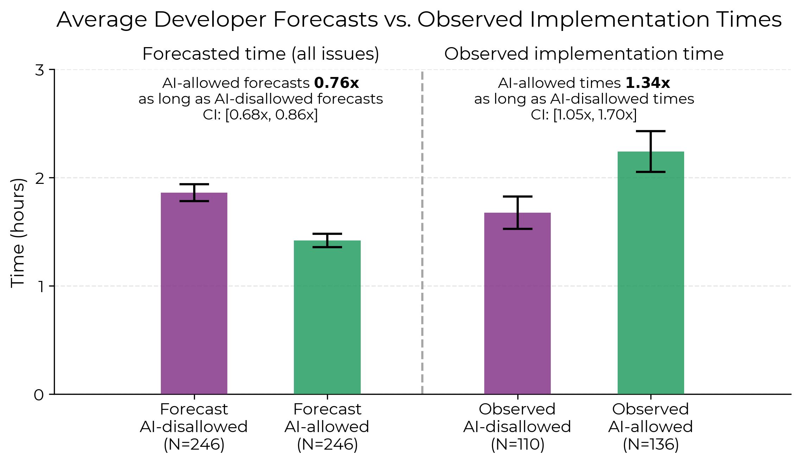
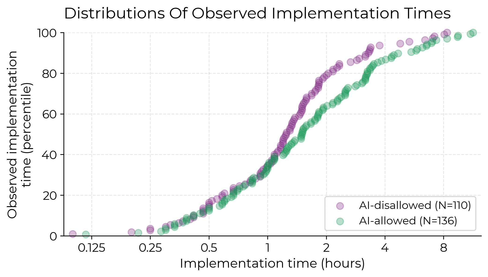

## Sobre o artigo âncora
# _Measuring the Impact of Early-2025 AI on Experienced Open-Source Developer Productivity_

## Resumo
O artigo aborda sobre uma pesquisa realizada com um grupo de desenvolvedores experientes em LLM's no intuito atingir um parâmetro estatístico sobre o aumento  — ou não — da produtividade em tarefas com o auxílio de IA.

Os desenvolvedores que participaram da pesquisa possuiam elevada experiência tanto no desenvolvimento de software quanto nos repositórios os quais contribuiam ativamente. Os repositórios eram de código aberto e possuiam em média 23.000 estrelas no GitHub.

Foram designadas 246 tarefas para o grupo de desenvolvedores intercalando entre atividades sem e com uso permitido de IA. A equipe responsável pela pesquisa forneceu LLM's em dois modelos, sendo eles em interfaces de usuário web — como Claude, ChatGPT — e em IDE's — como CursorPro —.

## Estimativas

### Desenvolvedores
Os desenvolvedores tiveram duas oportunidades de estimativa. 

- **Estimativa 1:** Questionada ***antes*** das tarefas designadas pela equipe de pesquisa;
- **Estimativa 2:** Questionada ***depois*** da conclusão de todas as tarefas designadas pela equipe de pesquisa.

| Estimativa 1 | Estimativa 2 |
| :------------: | :------------: |
| 24% de diminuição no tempo de conclusão | 20% de diminuição no tempo de conclusão

### Especialistas

Foi contratada uma equipe de especialistas para realizar previsões sobre o percentual de aumento na produtividade com a utilização de modelos de linguagem (LLM).

Os especialistas eram divididos em dois grupos: especialistas em Economia e especialistas em Machine Learning.

A previsão percentual de aumento na produtividade obtida foi:
 
| Economia | Machine Learning | 
| :------: | :---------------:|
| 38% de diminuição no tempo de conclusão | 39% de diminuição no tempo de conclusão |

## Resultados

### Gráficos 

Após a coleta e a análise de dados, os pesquisadorem puderam registrar graficamente as comparações entre atividades realizadas com e sem IA.

<h3 align="center"><em>Média prevista pelos desenvolvedores vs. Tempo de implementação observado</em></h3>

<h3 align="center"><em>Distribuição dos tempos de implementação observados</em></h3>  

> No primeiro gráfico, as comparações são realizadas em razão entre os tempos estimados e reais observados com IA permitida sobre IA proibida. No segundo gráfico, os dados aparecem em pontos (cada ponto representando uma tarefa), e se estendem ao longo do tempo até a conclusão total das tarefas.

Em questão de tempo de implementação, em ambos os gráficos é possível observar maior tempo necessário nas tarefas que foram permitidas ferramentas de IA.

### Conclusão

Por fim, a pesquisa concluiu que: ao permitir o uso de Inteligência Artificial como ferramenta de trabalho para os desenvolvedores, o tempo de implementação em tarefas/atividades se torna ***19% mais lento*** do que sem o uso da ferramenta, em média.

Em outras palavras, utilizar IA para auxiliar em problemas acaba por ser menos eficiênte do que apenas solucionar os problemas por conta própria.

## Autores & Artigo
Joel Becker, Nate Rush, Beth Barnes e David Rein.

BECKER, J.; RUSH, N.; BARNES, E.; REIN, D. Measuring the Impact of Early-2025
AI on Experienced Open-Source Developer Productivity. METR, 2025. [arxiv.org/abs/2507.09089](https://arxiv.org/abs/2507.09089)